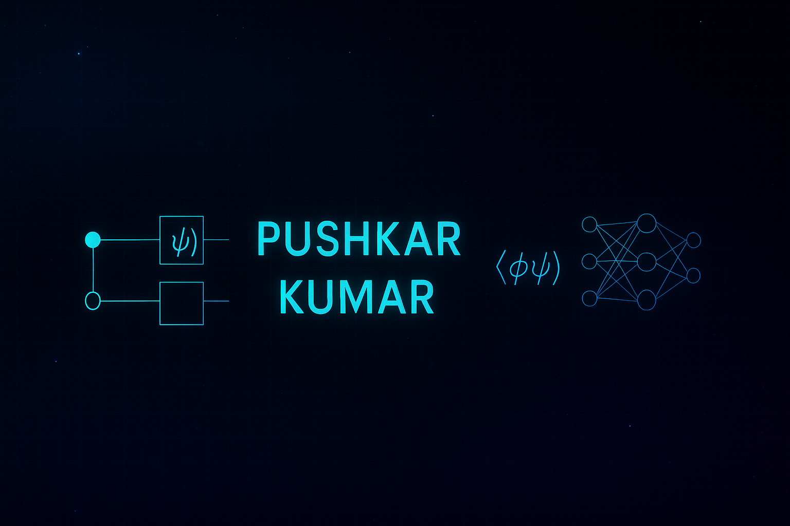

<!-- Banner -->

<h1 align="center">Hi 👋, I'm Pushkar Kumar</h1>
<h3 align="center">🚀 Passionate about Quantum Computing, AI/ML, and Building Real-World Projects</h3>

- 🎓 B.Tech Computer Science student at **MIT ADT University**
- ⚛️ Exploring **Quantum Machine Learning** & **Quantum Deep Reinforcement Learning**
- 🔬 Published research in Computer Vision (DenseNet-169 for Plant Disease Detection)
- 🧠 Projects on Smart Dustbin, AI Agents, and Writing a Quantum Computing Book
- 📚 Learning Quantum Computing with **CDAC + IIT Roorkee**
- 💡 Blending Physics, AI & Real-World Impact

---

### 🛠️ Tech Stack

---

### 📊 GitHub Stats

---

### 🌆 GitHub 3D Skyline

> View full interactive skyline here: [skyline.github.com/PushkarKumar-dev](https://skyline.github.com/Pushkar0997)

---

### 📫 Connect with Me

---

### ✨ Signature

> _"Combining quantum logic and artificial intelligence isn’t just the future — it’s my present."_
